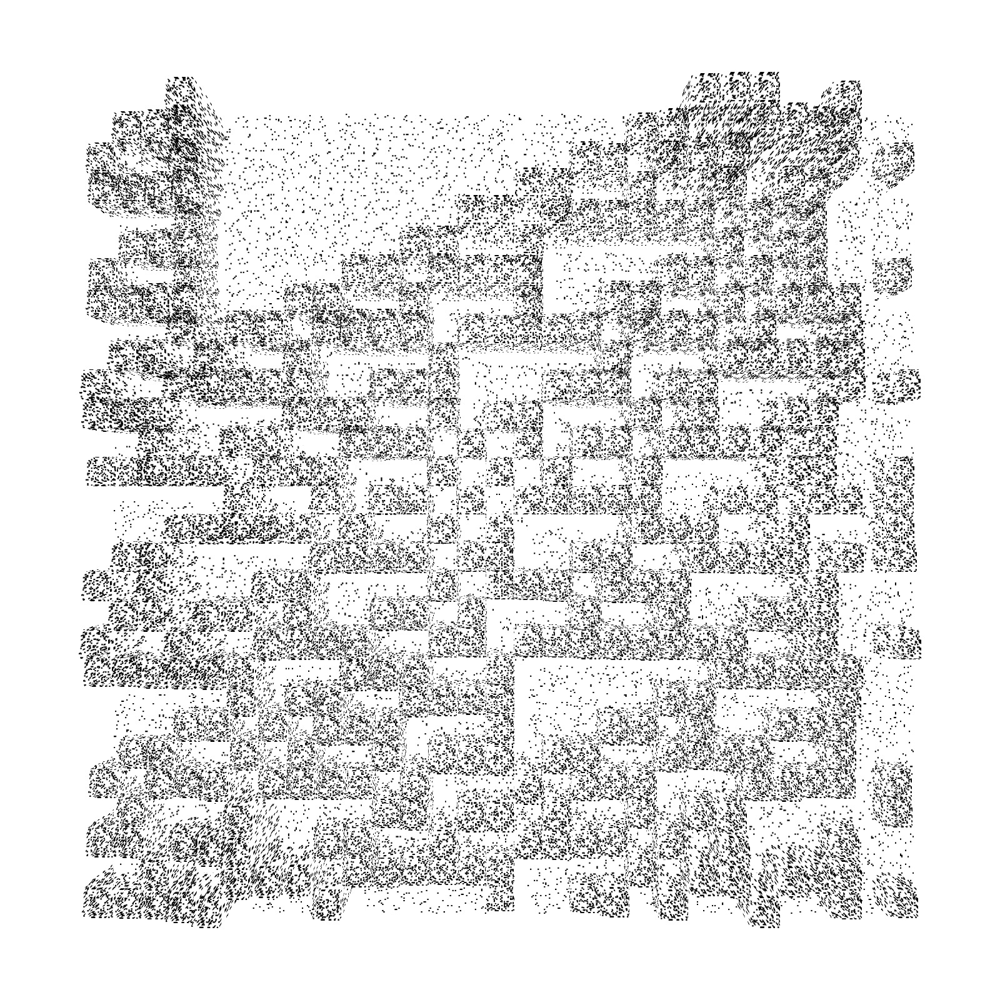
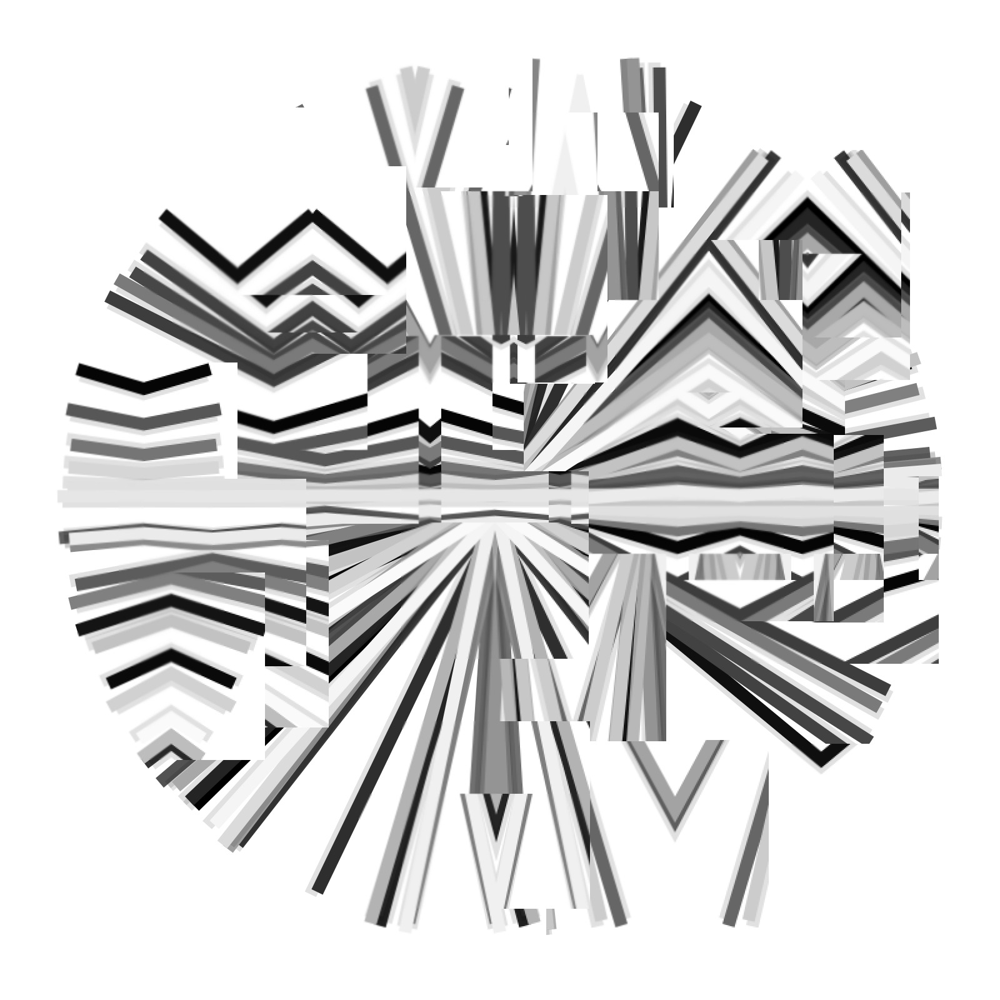

This is a small collection of JavaScript programs with visual output written for the [#genuary2021](https://genuary2021.github.io/) challenge on my [instagram](https://www.instagram.com/_matthiasjaeger/). Click on the image to visit a demo or use the link in the the title to get the code for each sketch. I used [p5-js](https://p5js.org) as my main renderer and these self written tools: [p5-toolkit](https://github.com/matthias-jaeger-net/p5-toolkit), [p5-glitch-effects](https://github.com/matthias-jaeger-net/p5-glitch-effects), [colorful-stripes](https://github.com/matthias-jaeger-net/colorful-stripes). All examples are stored in [genuary2021](https://github.com/matthias-jaeger-net/genuary2021) and hosted live as github pages [here](https://matthias-jaeger-net.github.io/genuary2021/).

## 01 | Triple nested loop
Exploring the flow of a triple nested for loop in a webgl canvas.

### [Code](https://github.com/matthias-jaeger-net/genuary2021/tree/main/genuary-01), [Live Demo](https://matthias-jaeger-net.github.io/genuary2021/genuary-01/)


## 02 | rule 30
I went for the standard 2D implementation with a initial randomly seeded row and then took it to 3D. I render cells that are alive as textured boxes and dead cells as textured planes. I modulate the height of the boxes with 2D noise for decorative reasons.

### [Code](https://github.com/matthias-jaeger-net/genuary2021/tree/main/genuary-02), [Live Demo](https://matthias-jaeger-net.github.io/genuary2021/genuary-02/)




## 03 | Make something human

During the lockdons due to the corona virus I missed seeing my human friends in real life the the most. When feeling lonely I'd take an A3 page and doodle large imaginairy faces with a big brush and acrylic paint. I'm not such a good painter, so I didn't share these portraits so far. For today's challenge I overlay the images with effects from my javascript library and gave them a final touch in the digital world.

### [Code](https://github.com/matthias-jaeger-net/genuary2021/tree/main/genuary-03), [Live Demo](https://matthias-jaeger-net.github.io/genuary2021/genuary-03/)


## 04 |  Small areas of symmetry

I traveled along random angles of a circle and at every angle sketched a rectangle on the page. Using my function sym() I cut small areas of the canvas and show the image next to a reflected version of itself.

### [Code](https://github.com/matthias-jaeger-net/genuary2021/tree/main/genuary-04), [Live Demo](https://matthias-jaeger-net.github.io/genuary2021/genuary-04/)




## 05 | Do some code golf!

How little code can you write to make something interesting? I made noisy black dots.

### [Code](https://github.com/matthias-jaeger-net/genuary2021/tree/main/genuary-05), [Live Demo](https://matthias-jaeger-net.github.io/genuary2021/genuary-05/)


## 06 | Triangle subdivision

Wrote several functions that help me get this simple animation done. The geometry you see is calculated from 3 given vectors and rotated, styled and diplayed in a p5 WEBGL canvas.

### [Code](https://github.com/matthias-jaeger-net/genuary2021/tree/main/genuary-06), [Live Demo](https://matthias-jaeger-net.github.io/genuary2021/genuary-06/)


## 07 | Generate some rules, then follow them by hand on paper
```
Take a paper
Take a pen
Move at a random location
Pen down
Move at a random location
Wiggle or not
Pen up
Look at the paper
Repeat until MAXLINES
Then start filling voids with black
```


*Permanent marker on 300x400 mm, 200g, Watercolor paper*

## 08 | Curve only

Inspired by floral drawings and minimalist aestethics I imagine a wild composition of blades of grass in a virtual landscape.

### [Code](https://github.com/matthias-jaeger-net/genuary2021/tree/main/genuary-08), [Live Demo](https://matthias-jaeger-net.github.io/genuary2021/genuary-08/)


## 09 | Interference patterns

Simple circles moving on the screen shape beautiful patterns.

### [Code](https://github.com/matthias-jaeger-net/genuary2021/tree/main/genuary-09), [Live Demo](https://matthias-jaeger-net.github.io/genuary2021/genuary-09/)


## 10 | TREE

I took a pen and sketched a landscape with a lone tree in the center. I imagine each branch would grow more branches, rotated by an angle. This is the classic recursive implementation, similar to the examples available online, but in this one I took great attention to the rendering. I designed the braches to respect the level of recusion. A semi-random structure of leaves with polygons remind f foliage. To give it more depth I added a ground and a sky. For these I used  horizontal lines modified by perlin noise to get that hand-drawn, sketchy look I wanted.

### [Code](https://github.com/matthias-jaeger-net/genuary2021/tree/main/genuary-10), [Live Demo](https://matthias-jaeger-net.github.io/genuary2021/genuary-10/)


