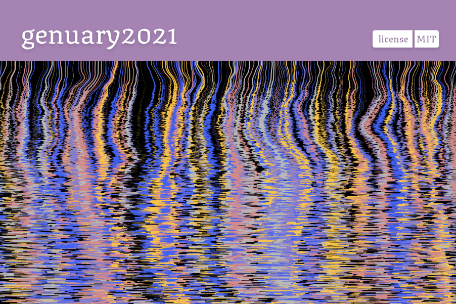

# genuary2021

This is a small collection of JavaScript programs with visual output written for the [#genuary2021](https://genuary2021.github.io/) challenge on my [instagram](https://www.instagram.com/_matthiasjaeger/). Click on the image to visit a demo or use the link in the the title to get the code for each sketch.

## I used these tools
- [p5-js](https://p5js.org) as my main renderer
- *Self written tools*
- - [p5-toolkit](https://github.com/matthias-jaeger-net/p5-toolkit)
- - [p5-glitch-effects](https://github.com/matthias-jaeger-net/p5-glitch-effects)
- - [colorful-stripes](https://github.com/matthias-jaeger-net/colorful-stripes)

# Sketches

All examples are stored in [genuary2021](https://github.com/matthias-jaeger-net/genuary2021) and hosted live as github pages [here](https://matthias-jaeger-net.github.io/genuary2021/).

## [Triple nested loop](https://github.com/matthias-jaeger-net/genuary2021/tree/main/genuary-1)

Exploring the flow of a triple nested for loop in a webgl canvas.

## [rule 30](https://github.com/matthias-jaeger-net/genuary2021/tree/main/genuary-2)

I went for the standard 2D implementation with a initial randomly seeded row and then took it to 3D. I render cells that are alive as textured boxes and dead cells as textured planes.I modulate the height of the boxes with 2D noise for decorative reasons.

## [Make something human](https://github.com/matthias-jaeger-net/genuary2021/tree/main/genuary-3)

During the lockdons due to the corona virus I missed seeing my human friends in real life the the most. When feeling lonely I'd take an A3 page and doodle large imaginairy faces with a big brush and acrylic paint. I'm not such a good painter, so I didn't share these portraits so far. For today's challenge I overlay the images with effects from my javascript library and gave them a final touch in the digital world.

## [Small areas of symmetry](https://github.com/matthias-jaeger-net/genuary2021/tree/main/genuary-4)

I traveled along random angles of a circle and at every angle sketched a rectangle on the page. Using my function sym() I cut small areas of the canvas and show the image next to a reflected version of itself.

## [Do some code golf!](https://github.com/matthias-jaeger-net/genuary2021/tree/main/genuary-5)

How little code can you write to make something interesting? I made noisy black dots.

